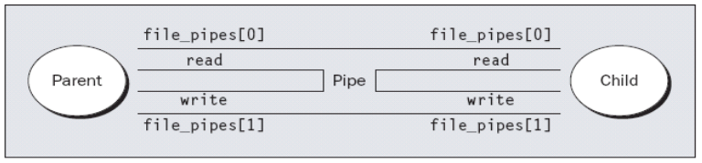
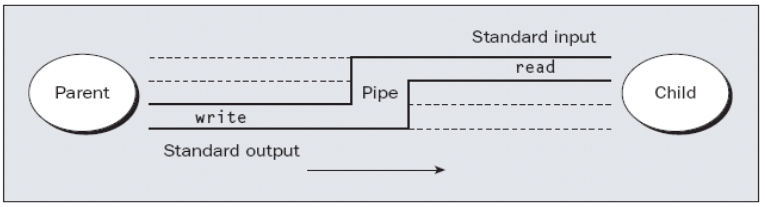
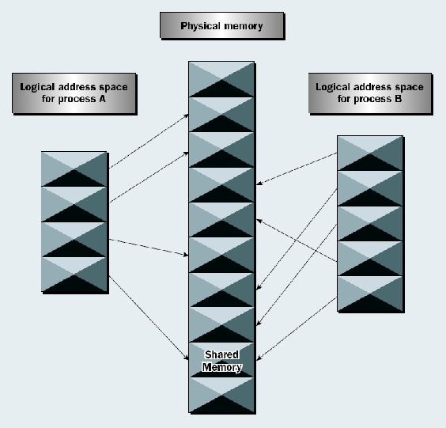

Linux Inter Process Communication(IPC)
======================================

1.Pipe란?
---------
- 한 프로세스에서 다른 프로세스로 데이터 흐름을 연결할 때 Pipe란 용어를 사용한다.
- 한 프로세스의 output을 다른 프로세스의 input으로 보내는 방법

#### 1) popen()함수, pclose()함수 사용
popen()은 파이프의 기능을 이용하여 다른 프로그램의 실행 결과를 읽어 들이거나, 다른프로그램의 표준 입력 장치로 출력 할 수 있다.

구분|설명
----|----
헤더|stdio.h
형태|FILE \*popen(**const char** \*command, **const char** \*type);
인수|**const char** \*command 실행할 명령어<br/>**const char** \*type 통신 형태
반환|NULL 이외의 값 성공<br/>NULL 실패

type|의미
----|----
'r'|파이프를 통해 입력 받습니다.
'w'|파이프로 출력합니다.

pclose()은 popen()에서 열기를 한 파이프 핸들 사용을 종료한다.

구분|설명
----|----
헤더|stdio.h
형태|**int** pclose(FILE \*stream)
인수|FILE \*stream 닫기를 할 파일 포인터
반환|-1 이외의 값 성공<br/>-1 실패

```c
#include<stdio.h>
#include<string.h>
#include<stdlib.h>
#include<unistd.h>

int main()
{
	FILE *read_fp;
	char buffer[BUFSIZ + 1]; //문자열의 마지막 NULL때문에 +1을 시켜준다.
	int chars_read;

	memset(buffer, '\0', sizeof(buffer));
	read_fp = popen("cat popen4.c | wc -l", "r"); //popen4.c형태의 파일을 cat으로 출력한다. 출력한 파일의 내용을 wc -l로 라인수를 가져온다.
                                                      //popen4.c의 줄 수는 29줄이다. 그러므로 파일 read_fp에는 29\n 이 들어있다.
	if(read_fp != NULL)
	{
		chars_read = fread(buffer, sizeof(char), BUFSIZ, read_fp); //read_fp에서 buffer에 내용을 읽어온다.
		while(chars_read > 0) //읽은 내용이 있다면 실행한다.
		{
			printf("%d\n", chars_read); //3이 출력된다. \n 도 문자이기 때문이다.
			buffer[chars_read - 1] = '\0'; //\n을 \0로 만들어 보기좋게 만든다.
			printf("Reading : -\n%s\n", buffer); //29가 출력된다.
			chars_read = fread(buffer, sizeof(char), BUFSIZ, read_fp); //다시 파일 read_fp에서 내용을 buffer로 읽어들인다. 내용이 없다면 반복문을 빠져나온다.
		}
		pclose(read_fp); //파이프 핸들 사용을 종료한다.
		exit(EXIT_SUCCESS);
	}
	exit(EXIT_FAILURE);
}
```

#### 2) pipe()함수 사용
pipe()은 디스크립터를 이용하여 프로세스끼리 통신(IPC)을 위해 파이프를 생성한다. 단 pipe()에서 생성한 파이프는 입출력 방향이 정해져 있다.

구분|설명
----|----
헤더|unistd.h
형태|**int** pipe(**int** filedes\[2])
인수|**int** filedes\[2] 파이프의 입출력 디스크립터
반환|0 성공<br/>-1 실패
> filedes\[0] 은 파이프의 읽기 전용 디스크립터<br/>filedes\[1] 은 파이프의 쓰기 전용 디스크립터

\[그림.1]

그림.1과 같이 pipe는 같은 출구과 입구를 사용하고 있기 때문에 만일 프로레스끼리 쌍방향 통신을 해야 한다면 Parent쪽에서 보낸 것을 child에서 읽기 전에 먼저 읽는다면 child는 읽을 수 없습니다.

\[그림.2]

그렇기 때문에 그림.3과 같은 방법으로 parent의 read를 끊어버리고 child의 write를 끊어버린다면, 일방 통행이 가능한 pipe가 됩니다.

\[그림.3]

결국 두개의 프로세스에서 pipe를 이용해서 read, write를 하려면 두개의 일방 통행 pipe를 생성하면 됩니다.
하지만, 서로다른 프로그램에서 실행된다면 프로세스는 디스크립터를 사용할 수 없기 때문에 FIFO를 이용해야한다.

##### 1. 하나의 pipe로 자신이 write한 내용을 자신이 read하는 코드 \[그림.1]
```c
#include<stdio.h>
#include<string.h>
#include<stdlib.h>
#include<unistd.h>

int main() 
{ 
	int data_processed; 
	int file_pipes[2]; 
	const char some_data[] = "123"; 
	char buffer[BUFSIZ + 1];
	memset(buffer, '\0', sizeof(buffer));
	if (pipe(file_pipes) == 0)
	{
		data_processed = write(file_pipes[1], some_data, strlen(some_data)); //pipe 쓰기 디스크립터에 some_data를 write한다.
		printf("Wrote %d bytes\n", data_processed); //읽어들인 길이를 출력
		data_processed = read(file_pipes[0], buffer, BUFSIZ); //pipe 읽기 디스크립터에서 내용을 buffer에 저장한다.
		printf("Read %d bytes: %s\n", data_processed, buffer); //buffer의 내용을 출력
		exit(EXIT_SUCCESS);
	}
	exit(EXIT_FAILURE);
}
```

##### 2. fork()를 사용해서 부모 프로세스 자식프로세스간 pipe()사용 \[그림.1]
```c
#include<unistd.h> 
#include<stdlib.h> 
#include<stdio.h> 
#include<string.h>
#include<sys/types.h>
#include<sys/wait.h>

int main() 
{ 
       	int data_processed;
	int file_pipes[2]; 
       	const char some_data[]="123"; 
       	const char some_data2[]="456"; 
	char buffer[BUFSIZ + 1]; 
	pid_t fork_result;
	int status;
     	memset(buffer,'\0', sizeof(buffer)); 
	
	if(pipe(file_pipes)==0)
	{ 
		fork_result = fork(); //자식 프로세스 생성
		if(fork_result==-1)
		{
			fprintf(stderr,"Fork failure"); 
			exit(EXIT_FAILURE);
		}
		if (fork_result == 0) 
		{ 
			sleep(1); //프로세스 속도때문에 자식이 부모의 쓰기 디스크립터를 읽어버린다.
			data_processed = write(file_pipes[1], some_data2, strlen(some_data2)); //456을 pipe 쓰기 디스크립터에 write한다.
			printf("child Wrote %d bytes\n", data_processed); //쓴 내용을 출력

			data_processed = read(file_pipes[0], buffer, BUFSIZ); //pipe 읽기 디스크립터로 read한다.
			printf("child Read %d bytes: %s\n", data_processed, buffer); //읽은 내용을 출력

			exit(EXIT_SUCCESS);
		}
		else
		{
			data_processed = write(file_pipes[1], some_data, strlen(some_data)); //123을 pipe 쓰기 디스크립터에 write한다.
			printf("parent Wrote %d bytes\n", data_processed); //쓴 내용을 출력

			data_processed = read(file_pipes[0], buffer, BUFSIZ); //pipe 읽기 디스크립터로 read한다.
			printf("parent Read %d bytes: %s\n", data_processed, buffer); //읽은 내용을 출력

			wait(&status); //자식 프로세스가 끝나기를 기다린다.
		}
	}
	exit(EXIT_SUCCESS);
}
```

##### 3. 서로 다른 프로세스간의 pipe를 이용하기 위한 argv 전달 \[그림.3]을 argv전달로 해결
- concept
> process1 -> fork() -> child : process2를 execl()로 실행 및 읽기 pipe 디스크립터 전달, parent : pipe에 쓰기<br/>process2 -> argv로 받은 pipe 읽기 디스크립터를 이용해서 pipe에서 읽기

```c
//process1
#include<unistd.h> 
#include<stdlib.h> 
#include<stdio.h> 
#include<string.h>
#include<sys/types.h>
#include<sys/wait.h>

int main() 
{ 
       	int data_processed;
	int file_pipes[2]; 
	const char some_data[]="123";
	char buffer[BUFSIZ + 1];
	int status;
	pid_t fork_result;
	memset(buffer,'\0', sizeof(buffer)); 
	if(pipe(file_pipes)==0)
	{
		fork_result = fork();
		if(fork_result==-1) //fork fail
		{
			fprintf(stderr,"Fork failure");
			exit(EXIT_FAILURE);
		}
		if(fork_result==0) //child process
		{
			sprintf(buffer,"%d", file_pipes[0]); //pipe 읽기 디스크립터를 buffer에 저장
			execl("pipe4", "pipe4", buffer, (char *)0); //process2를 실행하면서 인자값으로 buffer를 전달
			exit(EXIT_FAILURE); //실행이 제대로 되지않았다면 FAILURE
		}
		else //parent process
		{
			data_processed=write(file_pipes[1], some_data, strlen(some_data)); //pipe에 some_data를 write한다.
			printf("%d - wrote %d bytes\n", getpid(), data_processed); //자신의 pid와 쓴 길이를 출력
			wait(&status); //자식프로세스가 끝나기를 기다린다.
		}
	}
	exit(EXIT_SUCCESS);
}
```

```c
//process2
#include<unistd.h> 
#include<stdlib.h> 
#include<stdio.h> 
#include<string.h>
#include<sys/stat.h>
#include<fcntl.h>

int main(int argc, char *argv[])
{ 
	int data_processed;
	char buffer[BUFSIZ + 1];
	int file_descriptor;

	memset(buffer,'\0', sizeof(buffer)); //buffer 초기화
	sscanf(argv[1], "%d", &file_descriptor); //argv로 받은 pipe 읽기 디스크립터를 file_descriptor에 저장
       	data_processed = read(file_descriptor, buffer, BUFSIZ); //pipe에서 내용을 읽어 buffer에 저장
	printf("%d - read %d bytes: %s\n", getpid(), data_processed, buffer); //자신의 pid값과 읽은 내용을 출력
	exit(EXIT_SUCCESS);
}
```

##### 4. 부모 프로세스와 자식 프로세스간의 일방통행 pipe사용, dup()활용
dup()은 파일 디스크립터 복사본을 만든다. 원본 디스크립터와 복사된 디스크립터의 읽기/쓰기 포인터는 공유된다.

구분|설명
----|----
헤더|unistd.h
형태|**int** dup(**int** fildes)
인수|**int** fildes 파일 디스크립터
반환|복사된 파일 디스크립터 번호로 사용되지 않은 가장 작은 번호가 자동으로 지정되어 반환<br/>함수 실행이 실패되면 -1 이 반환

```c
#include<unistd.h> 
#include<stdlib.h> 
#include<stdio.h> 
#include<string.h>
#include<sys/types.h>
#include<sys/wait.h>

int main() 
{  
	int data_processed;
	int file_pipes[2]; 
	const char some_data[]="123"; 
	int fd;
	int status;
	pid_t fork_result;
	if(pipe(file_pipes)==0)
	{
		fork_result = fork(); //자식 프로세스 생성
		if(fork_result==-1)
		{ 
			fprintf(stderr,"Fork failure"); 
			exit(EXIT_FAILURE);
		}
		if(fork_result==0) //child process
		{
			close(0); //파일 디스크립터 0 = stdin, 파일 디스크립터 1 = stdout, 파일 디스크립터 2 = stderr
			fd = dup(file_pipes[0]); //읽기 전용 pipe 디스크립터를 복사
			if(fd != -1)
				printf("dup fd = %d\n", fd); //0번째 디스크립터가 없으므로 가장작은 번호인 0으로 fd값이 저장된다.
			else
				printf("can't dup\n");
			close(file_pipes[0]); //읽기 전용 pipe 디스크립터를 close
			close(file_pipes[1]); //쓰기 전용 pipe 디스크립터를 close
			//자식 프로세스는 0번째 디스크립터 위치에 복사본 읽기 전용 pipe 디스크립터만 가지고 있다.
			execlp("od", "od", "-c", (char *)0);
			//stdin(표준 입력-키보드)대신 pipe에 some_data값이 저장되어 있으므로 대체되어 od -c [pipe에 쓴 값] 으로 출력된다.
			exit(EXIT_FAILURE);
		}
		else //parent process
		{
			close(file_pipes[0]); //읽기 전용 pipe 디스크립터를 close
			//부모 프로세스는 쓰기 전용 pipe 디스크립터만 가지고 있다.
			data_processed = write(file_pipes[1], some_data, strlen(some_data)); //pipe에 some_data를 write한다
			close(file_pipes[1]); //쓰기 전용 pipe 디스크립터를 close
			printf("%d - wrote %d bytes\n", (int)getpid(), data_processed); //자신의 pid값과 pipe에 쓴 길이를 출력
			wait(&status); //자식 프로세스가 끝나기를 기다린다.
		}
	}
	exit(EXIT_SUCCESS);
}
```


2.FIFO(named pipe)란?
---------------------
- FIFO는 First In First Out의 줄임말이다. 먼저 입력된게 먼저 출력되는 선입선출의 데이터 구조를 의미한다.
- 전혀 관련 없는 프로세스들 사이에서 pipe를 이용해서 통신을 하려면 pipe에 이름이 주어져야한다. 그렇기 때문에 FIFO를 사용한다.
- pipe()에서 생성한 파이프를 이용하는 것은 부모, 자식 프로세스에서만 사용된다. 그러나 FIFO를 이용하면 서로 다른 프로세스에서 사용할 수 있으며, FIFO를 생성하는 파일 이름을 알고 있다면 누구나 사용할 수 있다.

##### mkfifo()함수 사용

구분|설명
----|----
헤더|sys/types.h, sys/stat.h
형태|**int** mkfifo(**const char** \*pathname, mode_t mode)
인수|**const char** \*pathname 파이프로 사용할 파일 이름<br/>mode_t mode FIFO파일에 대한 접근 권한
반환|0 성공<br/>-1 실패, errno에 에러 번호가 설정된다.

```c
#include<unistd.h> 
#include<stdlib.h> 
#include<stdio.h>
#include<sys/types.h>
#include<sys/stat.h>

int main()
{ 
	int res = mkfifo("/tmp/my_fifo", 0777); // /tmp/my_fifo를 만든다. 접근권한은 0777
	if(res == 0) 
		printf("FIFO created\n");
	exit(EXIT_SUCCESS);
}
```

3.메시지 큐 란?
---------------
- 메시지 큐는 IPC 방법 중에 하나로 자료를 다른 프로세스로 전송할 수 있다. 전송되는 자료도 큐의 용량이 허용하는 한, 상대편이 가져가지 않는다고 하더라도 계속 전송할 수 있으며, 나중에 다른 프로세스가 큐가 비워질 때까지 계속 읽어 들일 수 있다.<br/>또한 메시지 큐는 전송한는 자료를 커널이 간직하기 때문에 전송한 프로세스가 종료되었다고 하더라고 자료가 사라지지 않는다. 즉, 전송 프로세스가 데이터를 전송한 후 종료해도, 나중에 다른 프로세스가 메시지 큐의 데이터를 가져 올 수 있다.<br/>또한 전송되는 큐의 자료는 순자적으로 가져 갈 수도 있지만 데이터 타입에 따라 원하는 자료만 가져 갈 수 있다. 즉, 메시지 큐에 전송되는 데이터 구조는 아래와 같다.

```c
struct {
   long  data_type;
   //원하는 데이터
}
```

##### msgget()함수, msgsnd()함수, msgrcv()함수, msgctl()함수 사용
msgget()은 메시지 큐를 생성한다.

구분|설명
----|----
헤더|sys/types.h, sys/ipc.h, sys/msg.h
형태|**int** msgget(key_t key, **int** msgflg)
인수|key_t key 시스템에서 다른 큐와 구별하기 위한 번호<br/>**int** msgflg 옵션
반환|-1 이외의 메세지 큐 식별자 성공<br/>-1 실패

msgflg|의미
------|---
IPC_CREAT|key에 해당하는 큐가 있다면 큐의 식별자를 반환하며, 없으면 생성합니다.
IPC_EXCL|key에 해당하는 큐가 없다면 생성하지만 있다면 -1을 반환하고 복귀합니다.

msgsnd()은 메시지 큐로 데이터를 전송한다.

구분|설명
----|----
헤더|sys/types.h, sys/ipc.h, sys/msg.h
형태|**int** msgsnd(**int** msqid, **const void** \*msgp, size_t msgsz, **int** msgflg)
인수|**int** msqid 메시지 큐 식별자<br/>**const void** \*msgp 전송할 자료<br/>size_t msgsz 전송할 자료의 크기<br/>**int** msgflg 옵션
반환|0 성공<br/>-1 실패

msgflg|의미
------|---
0|큐에 공간이 생길 때 까지 기다립니다.
IPC_NOWAIT|큐에 여유 공간이 없다면 바로 -1 로 복귀합니다.

msgrcv()은 메시지 큐로부터 데이터를 수신한다.

구분|설명
----|----
헤더|sys/types.h, sys/ipc.h, sys/msg.h
형태|**int** msgrcv(**int** msqid, **const void** \*msgp, size_t msgsz, **long** msgtyp, **int** msgflg)
인수|**int** msqid 메시지 큐 식별자<br/>**const void** \*msgp 전송할 자료<br/>size_t msgsz 전송할 자료의 크기<br/>**long** msgtyp 옵션<br/>**int** msgflg 옵션
반환|0 성공<br/>-1 실패


msgtyp|의미
------|---
0|큐에 자료가 있다면 첫 번째의 자료를 읽어 들인다.
양수|양수로 지정한 값과 같은 data_type의 자료 중 첫 번째를 읽어 들인다.
음수|음수 값을 절대 값으로 변경하고, 이 절대값과 같거나 보다 제일 작은 data_type의 자료를 구한다. 메시지 큐에 data_type 이 1, 5, 15 이고 -10을 지정했다면 1의 데이터를 구하게 된다.

msgflg|의미
------|---
IPC_NOWAIT|메시지 큐에 메시지가 없다면 기다리지 않고 -1 로 복귀한다.
MSG_NOERROR|메시지 큐에 있는 자료가 준비된 데이터 크기보다 크다면 초과 부분을 잘라 내고 읽어 들일 수 있는 부분만 담아온다. 이 옵션이 없다면 메시지 큐에 자료가 있다고 하더라도 -1 로 실패된다.

msgctl()은 메시지 큐의 현재 상태 정보를 구할 수 있고, 변경하거나 아예 메시지 큐를 삭제 할 수 있다.

구분|설명
----|----
헤더|sys/types.h, sys/ipc.h, sys/msg.h
형태|**int** msgctl(**int** msqid, **int** cmd, **struct** msqid_ds \*buf)
인수|**int** msqid 메시지 큐 식별자<br/>**int** cmd 제어 명령<br/>**struct** msqid_ds \*buf 메시지 큐 정보를 받을 버퍼
반환|0 성공<br/>-1 실패

cmd|의미
------|---
IPC_STAT|메시지 큐의 현재 상태를 buf에 저장한다.
IPC_SET|메시지 큐의 상태를 buf 값으로 변경한다. 그러나 모든 정보는 안되고 msg_perm과 msg_qbytes 내용만 변경할 수 있다.
IPC_RMID|메시지 큐를 삭제한다. 이럴 때에는 buf가 필요 없으므로 buf를 0으로 지정한다.

세번째 인수인 buf의 구조는 다음과 같다.
```c
struct msqid_ds {
        struct ipc_perm msg_perm;
        struct msg *msg_first;          /* first message on queue,unused  */
        struct msg *msg_last;           /* last message in queue,unused */
        __kernel_time_t msg_stime;      /* last msgsnd time */
        __kernel_time_t msg_rtime;      /* last msgrcv time */
        __kernel_time_t msg_ctime;      /* last change time */
        unsigned long  msg_lcbytes;     /* Reuse junk fields for 32 bit */
        unsigned long  msg_lqbytes;     /* ditto */
        unsigned short msg_cbytes;      /* current number of bytes on queue */
        unsigned short msg_qnum;        /* number of messages in queue */
        unsigned short msg_qbytes;      /* max number of bytes on queue */
        __kernel_ipc_pid_t msg_lspid;   /* pid of last msgsnd */
        __kernel_ipc_pid_t msg_lrpid;   /* last receive pid */
};
```

- concept
> process1 : name, age, id를 입력한다. 입력한 내용을 메시지 큐에 send한다.<br/>process2 : 파일을 열고 메시지 큐의 내용을 recv한 내용을 파일에 write한다.

```c
//process1
#include<stdlib.h> 
#include<stdio.h> 
#include<string.h>
#include<errno.h> 
#include<unistd.h> 
#include<sys/types.h> 
#include<sys/ipc.h> 
#include<sys/msg.h>

struct person{
	long msg_type;
       	char name[10];
	int age;
	int id;
};

int main() 
{ 
	int running = 1;
	struct person who;
	int msgid;
	char buffer[BUFSIZ];
	msgid = msgget((key_t)0x1234, 0666 | IPC_CREAT);
	
	if (msgid == -1)
       	{
		fprintf(stderr, "msgget failed with error: %d\n", errno);
		exit(EXIT_FAILURE);
	}
	while(running) 
	{
		who.msg_type = 1;

		printf("Enter name : ");
		scanf("%s", who.name);

		printf("Enter age : ");
		scanf("%d", &who.age);
		
		printf("Enter id : ");
		scanf("%d", &who.id);

		printf("continue?(y/n) : ");
		scanf("%s", buffer);
		
		if(strcmp("n", buffer) == 0) //n이 입력되면 running이 0이되면서 while문을 수행하지 않는다.
		{
			running = 0;
			who.msg_type = 2; //마지막으로 보낼 msg는 msg_type을 2로 해서 보낸다.
		}

		if (msgsnd(msgid, (void *)&who, sizeof(who), 0) == -1) 
		{
			fprintf(stderr, "msgsnd failed\n");
		       	exit(EXIT_FAILURE);
		}
	}
	exit(EXIT_SUCCESS);
}
```

```c
//process2
#include<stdlib.h> 
#include<stdio.h> 
#include<string.h>
#include<errno.h> 
#include<unistd.h> 
#include<sys/types.h>
#include<sys/stat.h>
#include<sys/ipc.h> 
#include<sys/msg.h>
#include<fcntl.h>

struct person{
	long msg_type;
	char name[10];
	int age;
	int id;
};

int main() 
{ 
	int fd;
	int running = 1;
	int msgid;
	char buffer[BUFSIZ];
	char buf[10];
	struct person who;
	long int msg_to_receive = 0;

	fd = open("./person.txt", O_RDWR | O_CREAT | O_APPEND, \
			S_IRWXU | S_IWGRP | S_IRGRP | S_IROTH);

	msgid = msgget((key_t)0x1234, 0666 | IPC_CREAT);
	if (msgid == -1)
	{
		fprintf(stderr, "msgget failed with error: %d\n", errno);
	       	exit(EXIT_FAILURE);
	}

	while(running)
	{
		if (msgrcv(msgid, (void *)&who, BUFSIZ, msg_to_receive, 0) == -1)
		{
			fprintf(stderr, "msgrcv failed with error: %d\n", errno);
			exit(EXIT_FAILURE);
		} 

		printf("name : %s\n", who.name);
		printf("age : %d\n", who.age);
		printf("id : %d\n", who.id);

		sprintf(buffer, "name : %s\n", who.name);
		write(fd, buffer, strlen(buffer));

		sprintf(buffer, "age : %d\n", who.age);
		write(fd, buffer, strlen(buffer));

		sprintf(buffer, "id : %d\n", who.id);
		write(fd, buffer, strlen(buffer));

		write(fd, "--------------------\n", 21);

		//수신 받은 메시지의 msg_type이 2라면 process1에서 더이상 메시지를 보내지않는다는 것으로 다음 while을 수행하지 않는다.
		if (who.msg_type == 2)
	       	{
			running = 0;
		}
	}
	if (msgctl(msgid, IPC_RMID, 0) == -1) 
	{
		fprintf(stderr, "msgctl(IPC_RMID) failed\n");
	       	exit(EXIT_FAILURE);
	}
	close(fd);
	exit(EXIT_SUCCESS);
}
```

4.공유 메모리란?
---------------
- 공유 메모리는 단어 뜻에서 알 수 있듯이 하나의 프로세스에서가 아니라 여러 프로세스가 함께 사용하는 메모리를 말한다. 이 공유 메모리를 이용하면 프로세스끼리 통신을 할 수 있으며, 같은 데이터를 공유할 수 있다.
- 이렇게 같은 메모리 영역을 공유하기 위해서는 공유 메모리를 생성한 후에 프로세스의 자신의 영역에 첨부를 한 후에 마치 자신의 메모리를 사용하듯 사용한다.
- 즉, 공유 메모리를 사용하기 위해서는 공유 메모리를 생성한 후에, 이 메모리가 필요한 프로세스는 필요할 때 마다 자신의 프로세스에 첨부를 한 후에 다른 메모리를 사용하듯 사용하면 된다.



다음 그림과 같이 서로 다른 Process A, B가 물리적인 메모리를 공유하여 사용할 수 있다.

##### 1) shmget()함수, shmat()함수, shmdt()함수, shmctl()함수 사용
shmget()은 공유메모리를 생성한다.

구분|설명
----|----
헤더|sys/ipc.h, sys/shm.h
형태|**int** shmget(key_t key, **int** size, **int** shmflg)
인수|key_t key 공유 메모리를 구별하는 식별 번호<br/>**int** size 공유 메모리 크기<br/>**int** shmflg 동작 옵션
반환|-1 이외의 수(공유메모리 식별자) 성공<br/>-1 실패

shmflg|옵션 내용
------|--------
IPC_CREATE|key에 해당하는 공유 메모리가 없다면 새로 생성한다. 만약있다면 무시하며 생성을 위해 접근 권한을 지정해 주어야 한다.
IPC_EXCL|공유 메모리가 이미 있다면 실패로 반환하며 공유 메모리에 접근하지 못한다. 이 옵션이 없어야 기존 공유 메모리에 접근할 수 있다.

shmat()은 공유메모리를 마치 프로세스의 몸안으로 첨부한다.(연결)

구분|설명
----|----
헤더|sys/type.h, sys/shm.h
형태|**void** \*shmat(**int** shmid, **const void** \*shmaddr, **int** shmflg)
인수|**int** shmid 공유 메모리를 구별하는 식별 번호<br/>**const void** \*shmaddr 첨부되는 어드레스 주소. 일반적으로 NULL을 지정<br/>**int** shmflg 동작 옵션
반환|-1 이외의 수(공유메모리 주소) 성공<br/>(void \*)-1 실패

shmflg|옵션 내용
------|--------
SHM_RDONLY|공유 메모리를 읽기 전용으로
SHM_RND|shmaddr이 NULL이 아닌 경우일 때만 사용되며, shmaddr을 반올림하여 메모리 페이지 경계에 맞춘다.

shmdt()은 프로세스에 첨부된 공유메모리를 프로세스에서 분리한다.

구분|설명
----|----
헤더|sys/type.h, sys/shm.h
형태|**int** shmdt(**const void** \*shmaddr)
인수|**const void** \*shmaddr 분리할 공유 메모리 주소
반환|0 성공<br/>-1 실패

shmctl()은 공유메모리에 대한 정보를 구하거나 변경 또는 제거 한다.

구분|설명
----|----
헤더|sys/ipc.h, sys/shm.h
형태|**int** shmctl(**int** shmid, **int** cmd, **struct** shmid_ds \*buf)
인수|**int** shmid 공유 메모리 식별 번호<br/>**int** cmd 제어 명령<br/>**struct** shmid_ds \*buf 공유 메모리 정보 구하기 위한 버퍼 포인터 
반환|0 성공<br/>-1 실패

```c
struct shmid_ds {
  struct    ipc_perm shm_perm;/* 접근권한 */
  int  shm_segsz;            /* 세그먼트의 크기(bytes) */
  time_t    shm_atime;       /* 마지막 접근 시간 */
  time_t    shm_dtime;       /* 마지막 제거 시간 */
  time_t    shm_ctime;       /* 마지막 변경 시간 */
  unsigned short shm_cpid; /* 생성자의 프로세스의 프로세스 id */
  unsigned short shm_lpid; /* 마지막으로 작동한 프로세스의 프로세스 pid */
  short     shm_nattch;     /* 현재 접근한 프로세스의 수 */
  /* 다음은 개별적이다 */
  unsigned short   shm_npages; /* 세그먼트의 크기(pages) */
  unsigned long   *shm_pages;
  struct shm_desc *attaches;    /* 접근을 위한 기술자들 */
  };

shm_perm 멤버의 필드들은 아래와 같이 설정할 수 있습니다.
struct ipc_perm{
       key_t  key;
       ushort uid;   /* owner의 euid 와 egid */
       ushort gid;
       ushort cuid;  /* 생성자의 euid 와 egid */
       ushort cgid;
       ushort mode;  /* 접근 모드의 하위 9 bits */
       ushort seq;   /* 연속 수(sequence number) */
     };
```

- concept
> process1 : 메시지 큐로 process2에 자신의 pid를 send<br/>process2 : process1의 pid를 받고 자신의 pid를 메시지큐로 send 후 시그널을 보낸다.<br/>process1 : 공유메모리를 생성 → 공유메모리 첨부 → 공유메모리에 0~100까지의 숫자를 입력 → process2에 시그널 보낸 후 pause상태<br/>process2 : 공유메모리 생성 → 공유메모리 첨부 → 공유메모리의 숫자를 읽어온다. → process1에 시그널을 보낸다. → 첨부를 해제한다.<br/>process1 : 공유메모리첨부를 해제한다. → 공유메모리를 제거한다.

```c
//process1
#include<stdio.h>
#include<unistd.h>
#include<stdlib.h>
#include<stdio.h>
#include<errno.h>
#include<sys/types.h>
#include<sys/ipc.h>
#include<sys/shm.h>
#include<sys/msg.h>
#include<sys/stat.h>
#include<fcntl.h>
#include<signal.h>

#define SHMSIZE 100

struct mq_pid{
	long msg_type;
	pid_t pid;
};

static void sigHandler(int sig)
{
	if(sig == SIGUSR1)
	{
		printf("I Get Signal from process2\n");
	}	
	if(sig == SIGUSR2)
	{
		printf("Process2 : Finish to read the Memory\n");
	}
}

int main(void)
{
	int running = 1;
	int msgid;
	long int msg_to_receive = 0;
	struct mq_pid mypid;
	key_t Keyvalue;
	pid_t pro2;

	void *shared_Mem = (void*)0;
	int shmid;
	int *shmaddr;
	int i;

	Keyvalue = ftok("/home/pi", 'S');
	msgid = msgget(Keyvalue, 0666 | IPC_CREAT);
	
	if(signal(SIGUSR1, sigHandler) == SIG_ERR)
		printf("ERROR : system signal(SIGUSR1)\n");
	if(signal(SIGUSR2, sigHandler) == SIG_ERR)
		printf("ERROR : system signal(SIGUSR2)\n");

	if(msgid == -1)
	{
		fprintf(stderr, "msgget failed with error: %d\n", errno);
		exit(EXIT_FAILURE);
	}

	mypid.msg_type = 1;
	mypid.pid = getpid();
	printf("My pid = %d\n", mypid.pid);

	if(msgsnd(msgid, (void *)&mypid, sizeof(mypid), 0) == -1)
	{
		fprintf(stderr, "msgsnd failed\n");
		exit(EXIT_FAILURE);
	}

	printf("Success to Send pid message\n");

	pause();

	if(msgrcv(msgid, (void *)&mypid, BUFSIZ, msg_to_receive, 0) == -1)
	{
		fprintf(stderr, "msgrcv failed with error: %d\n", errno);
		exit(EXIT_FAILURE);
	}
	pro2 = mypid.pid;
	printf("Process2 pid : %d\n", pro2);	

	if (msgctl(msgid, IPC_RMID, 0) == -1) 
	{
		fprintf(stderr, "msgctl(IPC_RMID) failed\n");
	       	exit(EXIT_FAILURE);
	}
	
	//1. shmget
	shmid = shmget((key_t)1234, sizeof(int) * SHMSIZE, 0666 | IPC_CREAT);
	if(shmid == -1)
	{
		fprintf(stderr, "shmget failed\n");
		exit(EXIT_FAILURE);
	}

	//2. shmat
	shared_Mem = shmat(shmid, (void*)0, 0);
	if(shared_Mem == (void*)-1)
	{
		fprintf(stderr, "shmat failed\n");
		exit(EXIT_FAILURE);
	}

	printf("Memory attached at 0x%p\n", shared_Mem);
	shmaddr = (int*)shared_Mem;

	//3. memory access
	for(i = 0; i<SHMSIZE; i++)
	{
		*(shmaddr+i) = i+1;
		printf("shmaddr : %p, data : %d\n", shmaddr+i, *(shmaddr+i));
	}
	
	kill(pro2, SIGUSR2);
	pause();

	//4. shmdt
	if(shmdt(shared_Mem) == -1)
	{
		fprintf(stderr, "shmdt failed\n");
		exit(EXIT_FAILURE);
	}

	//5. shmctl : IPC_RMID
	if(shmctl(shmid, IPC_RMID, 0) == -1)
	{
		fprintf(stderr, "shmctl(IPC_RMID) failed\n");
		exit(EXIT_FAILURE);
	}
	exit(EXIT_SUCCESS);
}
```

```c
//process2
#include<stdio.h>
#include<unistd.h>
#include<stdlib.h>
#include<stdio.h>
#include<errno.h>
#include<sys/types.h>
#include<sys/ipc.h>
#include<sys/shm.h>
#include<sys/msg.h>
#include<sys/stat.h>
#include<fcntl.h>
#include<signal.h>

#define SHMSIZE 100

struct mq_pid{
	long msg_type;
	pid_t pid;
};

static void sigHandler(int sig)
{
	if(sig == SIGUSR2)
	{
		printf("Process1 : Finish to write the Memory\n");
	}
}

int main(void)
{
	int running = 1;
	int msgid;
	long int msg_to_receive = 0;
	struct mq_pid mypid;
	key_t Keyvalue;
	pid_t pro1;

	void *shared_Mem = (void*)0;
	int shmid;
	int *shmaddr;
	int i;

	Keyvalue = ftok("/home/pi", 'S');
	msgid = msgget(Keyvalue, 0666 | IPC_CREAT);

	if(signal(SIGUSR2, sigHandler) == SIG_ERR)
		printf("ERROR : system signal(SIGUSR2)\n");

	if(msgid == -1)
	{
		fprintf(stderr, "msgget failed with error: %d\n", errno);
		exit(EXIT_FAILURE);
	}
	
	if(msgrcv(msgid, (void *)&mypid, BUFSIZ, msg_to_receive, 0) == -1)
	{
		fprintf(stderr, "msgrcv failed with error: %d\n", errno);
		exit(EXIT_FAILURE);
	}
	pro1 = mypid.pid;
	printf("Process1 pid : %d\n", pro1);

	mypid.msg_type = 1;
	mypid.pid = getpid();
	printf("My pid = %d\n", mypid.pid);
	
	if(msgsnd(msgid, (void *)&mypid, sizeof(mypid), 0) == -1)
	{
		fprintf(stderr, "msgsnd failed\n");
		exit(EXIT_FAILURE);
	}
	
	printf("Success to Send pid message\n");

	kill(pro1, SIGUSR1);
	pause();
	
	//1. shmget
	shmid = shmget((key_t)1234, sizeof(int) * SHMSIZE, 0666 | IPC_CREAT);
	if(shmid == -1)
	{
		fprintf(stderr, "shmget failed\n");
		exit(EXIT_FAILURE);
	}

	//2. shmat
	shared_Mem = shmat(shmid, (void*)0, 0);
	if(shared_Mem == (void*)-1)
	{
		fprintf(stderr, "shmat failed\n");
		exit(EXIT_FAILURE);
	}

	printf("Memory attached at 0x%p\n", shared_Mem);
	shmaddr = (int*)shared_Mem;

	//3. memory access
	for(i = 0; i<SHMSIZE; i++)
	{
		printf("shmaddr : %p, data : %d\n", shmaddr+i, *(shmaddr+i));
	}

	kill(pro1, SIGUSR2);

	//4. shmdt
	if(shmdt(shared_Mem) == -1)
	{
		fprintf(stderr, "shmdt failed\n");
		exit(EXIT_FAILURE);
	}
	exit(EXIT_SUCCESS);
}
```

##### 2) 1)의 내용을 fork()사용으로 자식이 process2를 실행시키면서 process1의 파일 내용을 process2에서 복사 파일 만들기
```c
//process1
#include<stdio.h>
#include<unistd.h>
#include<stdlib.h>
#include<stdio.h>
#include<errno.h>
#include<sys/types.h>
#include<sys/ipc.h>
#include<sys/shm.h>
#include<sys/stat.h>
#include<fcntl.h>
#include<signal.h>
#include<string.h>
#include<sys/msg.h>
#include<sys/wait.h>
#include"MyKey.h"

volatile sig_atomic_t quitflag = 1;

static void sigHandler(int sig){}

int main(void)
{
	pid_t cpid;
	
	key_t Keyvalue;
	struct Mystatus st;
	int msgid;
	
	void *shared_Mem = (void*)0;
	int shmid;
	char *shmaddr;
	long int msg_to_receive = 0;
	
	int i;
	char buf[10];
	char fdbuf[SHMSIZE];
	int size;
	int status;

	FILE *fd;
	
	printf("my(write) pid is %d\n", getpid());
	
	if(signal(SIGUSR1, sigHandler) == SIG_ERR)
		printf("ERROR : system signal(SIGUSR2)\n");

		//1. shmget
		shmid = shmget(SHMKEY, sizeof(char) * SHMSIZE, 0666 | IPC_CREAT);
		if(shmid == -1)
		{
			fprintf(stderr, "shmget failed\n");
			exit(EXIT_FAILURE);
		}

		//2. shmat
		shared_Mem = shmat(shmid, (void*)0, 0);
		if(shared_Mem == (void*)-1)
		{
			fprintf(stderr, "shmat failed\n");
			exit(EXIT_FAILURE);
		}
		
		sprintf(buf, "%d", shmid);		

		printf("parent : Memory attached at 0x%p\n", shared_Mem);
		shmaddr = (char*)shared_Mem;


	if((cpid = fork()) == -1) //failed
	{
		printf("ERROR : SYSTEM fork() failed\n");
		exit(EXIT_FAILURE);
	}
	
	if(cpid == 0) //child
	{
		printf("Im child\n");
		if(execlp("./shmreader3", "./shmreader3", buf, NULL) == -1)
		{
			printf("ERROR : SYSTEM execlp() failed\n");
			exit(EXIT_FAILURE);
		}
		printf("execlp() success\n");
	}
	else //parent
	{		
		printf("Im parent\n");
		printf("my child pid is %d\n", cpid);
		
		Keyvalue = ftok(STRING, PROJ_ID);
		msgid = msgget(Keyvalue, 0666 | IPC_CREAT);
		
		if(msgid == -1)
		{
			fprintf(stderr, "msgget failed with error: %d\n", errno);
			exit(EXIT_FAILURE);
		}
		st.msg_type = 1;
		
		fd = fopen(FILE_NAME1, "rb");
		
		while(quitflag)
		{
			if(msgrcv(msgid, (void *)&st, sizeof(st), msg_to_receive, 0) == -1)
			{
				fprintf(stderr, "msgrcv failed with error: %d\n", errno);
				exit(EXIT_FAILURE);
			}
			
			//3. memory access
			size = fread(fdbuf, 1, SHMSIZE, fd);
			
			if(size == -1)
			{
				printf("ERROR : SYSTEM read() failed\n");
				exit(EXIT_FAILURE);
			}
			if(size < SHMSIZE)
				quitflag = 0;
			
			//3. memory access
			strcpy(shmaddr, fdbuf);
			
			st.len = size;
			
			if(msgsnd(msgid, (void *)&st, sizeof(st), 0) == -1)
			{
				fprintf(stderr, "msgsnd failed\n");
				exit(EXIT_FAILURE);
			}

			usleep(1);
			kill(cpid, SIGUSR1);
			pause();
		}
		
		wait(&status);
		fclose(fd);
		
		if (msgctl(msgid, IPC_RMID, 0) == -1) 
		{
			fprintf(stderr, "msgctl(IPC_RMID) failed\n");
	       	exit(EXIT_FAILURE);
		}
		
		//4. shmdt
		if(shmdt(shared_Mem) == -1)
		{
			fprintf(stderr, "shmdt failed\n");
			exit(EXIT_FAILURE);
		}		
		
		//5. shmctl : IPC_RMID
		if(shmctl(shmid, IPC_RMID, 0) == -1)
		{
			fprintf(stderr, "shmctl(IPC_RMID) failed\n");
			exit(EXIT_FAILURE);
		}
	}
	exit(EXIT_SUCCESS);
}
```

```c
//process2
#include<stdio.h>
#include<unistd.h>
#include<stdlib.h>
#include<stdio.h>
#include<errno.h>
#include<sys/types.h>
#include<sys/ipc.h>
#include<sys/shm.h>
#include<sys/stat.h>
#include<fcntl.h>
#include<signal.h>
#include<string.h>
#include<sys/msg.h>
#include"MyKey.h"

volatile sig_atomic_t quitflag = 1;

static void sigHandler(int sig){}

int main(int argc, char* argv[])
{
	pid_t ppid;
	
	key_t Keyvalue;
	struct Mystatus st;
	int msgid;
	
	void *shared_Mem = (void*)0;
	int shmid;
	char *shmaddr;
	long int msg_to_receive = 0;
	
	int i;
	char fdbuf[SHMSIZE];
	int size;
	
	FILE *fd;
	
	ppid = getppid();
	printf("my parent pid is %d\n", ppid);
	printf("my(read) pid is %d\n", getpid());
	if(signal(SIGUSR1, sigHandler) == SIG_ERR)
		printf("ERROR : system signal(SIGUSR1)\n");
	
	shmid = atoi(argv[1]);

	//2. shmat
	shared_Mem = shmat(shmid, (void*)0, 0);
	if(shared_Mem == (void*)-1)
	{
		fprintf(stderr, "shmat failed\n");
		exit(EXIT_FAILURE);
	}

	printf("child : Memory attached at 0x%p\n", shared_Mem);
	shmaddr = (char*)shared_Mem;
	
	Keyvalue = ftok(STRING, PROJ_ID);
	msgid = msgget(Keyvalue, 0666 | IPC_CREAT);
	
	if(msgid == -1)
	{
		fprintf(stderr, "msgget failed with error: %d\n", errno);
		exit(EXIT_FAILURE);	
	}
	st.msg_type = 1;
	
	fd = fopen(FILE_NAME2, "ab");
	
	while(quitflag)
	{
		if(msgsnd(msgid, (void *)&st, sizeof(st), 0) == -1)
		{
			fprintf(stderr, "msgsnd failed\n");
			exit(EXIT_FAILURE);
		}
		pause();

		if(msgrcv(msgid, (void *)&st, sizeof(st), msg_to_receive, 0) == -1)
		{
			fprintf(stderr, "msgrcv failed with error: %d\n", errno);
			exit(EXIT_FAILURE);
		}
		
		//3. memory access
		strncpy(fdbuf, shmaddr, st.len);

		size = fwrite(fdbuf, 1, st.len, fd);

		if(size < SHMSIZE)
			quitflag = 0;
			
		usleep(1);
		kill(ppid, SIGUSR1);
	}

	fclose(fd);

	//4. shmdt
	if(shmdt(shared_Mem) == -1)
	{
		fprintf(stderr, "shmdt failed\n");
		exit(EXIT_FAILURE);
	}		
	
	exit(EXIT_SUCCESS);
}
```
